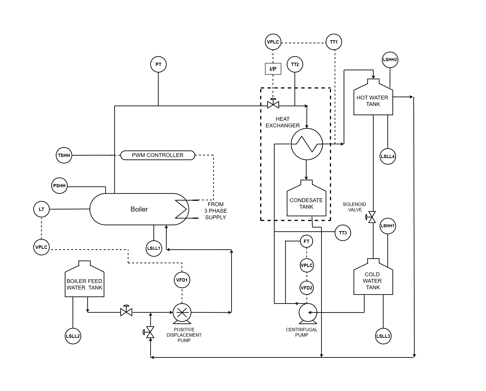

## Theory

A boiler is an enclosed vessel that provides a means for combustion heat to be transferred into water until it becomes heated water or steam. The hot water or steam under pressure is then usable for transferring the heat to a process. Water is a useful and cheap medium for transferring heat to a process. When water is boiled into steam its volume increases about 1,600 times, producing a force that is almost as explosive as gunpowder. This causes the boiler to be extremely dangerous equipment that must be treated with utmost care.[1]. The process of heating a liquid until it reaches its gaseous state is called evaporation. Heat is transferred from one body to another by means of radiation, which is the transfer of heat from a hot body to a cold body without a conveying medium, convection, the transfer of heat by a conveying medium, such as air or water and conduction, transfer of heat by actual physical contact, molecule to molecule.

- Boiler Make & Year: Non IBR Boiler & 2012

- MCR(Maximum Continuous Rating) : 30Kg/hr

- Rated Working Pressure: 3.5 Bar

- Type of Boiler: Drum Boiler

#### Boiler Specifications: 

The heating surface is any part of the boiler metal that has hot gases of combustion on one side and water on the other. Any part of the boiler metal that actually contributes to making steam is heating surface. The amount of heating surface of a boiler is expressed in square meters.

#### Indian Boiler Regulation:

The Indian Boilers Act was enacted to consolidate and amend the law relating to steam boilers. Indian Boilers Regulation (IBR) was created in exercise of the powers conferred by section 28 & 29 of the Indian Boilers Act.IBR Steam Boilers means any closed vessel exceeding 22.75 liters in capacity and which is used expressively for generating steam under pressure and includes any mounting or other fitting attached to such vessel, which is wholly or partly under pressure when the steam is shut off.IBR Steam Pipe means any pipe through which steam passes from a boiler to a prime mover or other user or both, if pressure at which steam passes through such pipes exceeds 3.5 kg/cm2 above atmospheric pressure or such pipe exceeds 254 mm in internal diameter and includes in either case any connected fitting of a steam pipe.

#### Shrink and swell effect in Boiler:

For the Boilers working at very high pressures and large evaporation rates, a phenomenon called swelling and shrinking of drum level makes such simple control strategies inadequate. When steam demand increases pressure decreases, this results in formation of bubbles which indicates level high. This phenomenon is called as shrink.This absurd increase in the level will cause decrease in feed flow rate. Because of high drum pressure, bubbles formation increases. This phenomenon is called swell which causes further decrease in level.

#### Heat Exchanger

A heat exchanger is a piece of equipment built for efficient heat transfer from one medium to another. The media may be separated by a solid wall, so that they never mix, or they may be in direct contact. They are widely used in space heating, refrigeration, air conditioning, power plants, chemical plants, petrochemical plants, petroleum refineries, natural gas processing, and sewage treatment. There are two primary classifications of heat exchangers according to their flow arrangement. In parallel flow heat exchangers, the two fluids enter the exchanger at the same end, and travel in parallel to one another to the other side. In counter-flow heat exchangers the fluids enter the exchanger from opposite ends. A double-pipe heat exchanger is the simplest type of heat exchanger and can operate with co-current or counter-current flow.The design consists of a single small pipe (tube-side) inside of a larger one (shell side). A co-current heat exchanger is most commonly used when you want the exiting streams to leave the exchanger at the same temperature. A counter-current heat exchanger is used more often than co-current because they allow for a more efficient transfer of energy.

#### Fouling in Heat Exchanger

Fouling is the accumulation of unwanted material on solid surfaces which can contain living organisms (bio-fouling)or nonliving material.Fouling includes deposit formation,encrustation, curding, deposition, scaling, scale formation,slugging, and sludge formation.

#### Expected Outcome:

-	The pilot plant will be fully functional always.
-	User will able to control the plant by Local PLC, Remote PLC, Remote DCS, Virtual PLC & Virtual DCS.
-	User will be able to monitor the plant by SCADA and will be notified by alarm if something goes wrong
-	Interconnection of various plants so as to run them simultaneously to observe  interaction
-	Run the pilot plants continuously and efficiently

#### About the Plant:

1.	Process Description:
A pilot plant comprises of Electrical Boiler and Pipe in pipe type Heat Exchanger as shown in below picture. 

The boiler drum made up SS304 contains water which is electrically heated with a PWMcontroller and generates steam at 4 bar and 144° C. The water for heating is pumped from a boiler feed water tank using a positive displacement pump. The steam generated flows towards the heat exchanger through an equal percentage globe valve which controls the steam flow. 

The heat exchanger being of tubular counter flow type, water to be heated is pumped from a cold water tank from the other end using a centrifugal pump. The condensate formed in the heat exchanger during heat transfer is collected in a separate condensate tank. The hot water is collected in hot water tank which also be either mixed in the cold water tank or can be added partially/fully to the feed to the boiler to change the feed water temperature.

The boiler pilot plant is providing steam to other pilot plants such as evaporator, bio-reactor and batch process. The heat exchanger pilot plant is giving hot water for sterilization process of bio-reactor pilot plant and is able to provide hot water to batch process for CIP. Hence the command to start the boiler needs to be received from these plants as their steam demand.

Plant Control and Instrumentation:
The instrumentation associated with the Boiler and heat exchanger plant can be divided in the following groups:

1.	Sensors and transmitters
The transducer measures a process variable while the transmitter transmits the data to the controller as a 4-20 mA current signal.(List with tag name are mentioned in index-A)

2.	Final control elements
The final control element adjusts the amount of energy/mass that goes into or out from process as commanded by the controller. Following are the final control elements used in the plant:

a.	Positive displacement pump for feeding boiler feed water: The speed of the motor and in turn feed flow is changed using variable frequency drive.
b.	Centrifugal pump for feeding cold water to heat exchanger: The speed of the motor and in turn feed flow is changed using variable frequency drive.
c.	Equal percentage globe control valve for manipulating steam flow : Current signal from controller is converted to pneumatic signal using an I/P converter which decides the valve opening.
d.	Solenoid valve which has 2 positions (open or close): Opening of the valve allows mixing of hot water with the cold water feed for heat exchanger as well as changing the boiler feed water temperature.

#### e. Safety components: 

These components ensure process safety which generally refers to the prevention of unintentional releases of chemicals, energy, or other potentially dangerous materials(including steam) during the course of process that can have a serious effect to the plant and environment. Process safety involves, for example, the prevention of leaks,spills, equipment malfunction, over-pressures, over-temperatures, corrosion, metal fatigue and other similar conditions. Following instruments are included to keep process variables under safe limit as well as provide alarms interlocks to automatically take necessary action:

#### a. Pressure switch and temperature switch: 

Shuts off the boiler if drum pressure/temperature exceeds 4 bar/144° C.

#### b. Low level switches: 

For the boiler drum this switch, shuts o_ the heater if there is no water in the drum. For other tanks these switches are used to avoid dry running of pumps if there is nothing to pump in the tanks.

#### c. High level switches:

Provided to the cold water and hot water tanks to avoid over flow of liquid.
